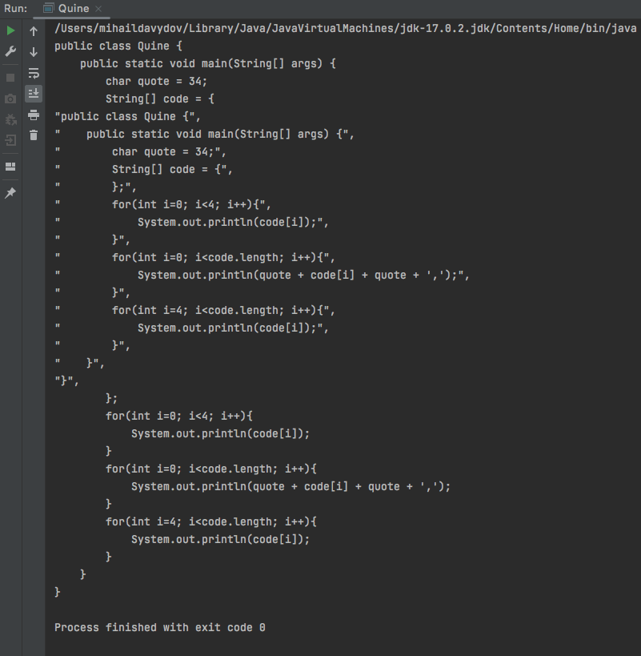

# Algorithms & Sorts
This repository contains various algorithms and sortings:

#### Luna algorithm
The Luna algorithm is an algorithm for calculating the check digit of a plastic card number in accordance with the ISO/IEC 7812 standard.

It is intended primarily for detecting errors caused by unintentional data distortion (for example, when manually entering a card number). It allows only with some degree of certainty to judge the absence of errors in the block of digits, but does not allow finding and correcting the detected inaccuracy.

The algorithm was developed by an IBM employee with Hans Peter Lunn, described in the USA in 1954, the patent was obtained in 1960.

The most common uses for counting the check digit are:

- All bank card numbers
- Numbers of some discount cards
- Social Security codes
- IMEI codes
- Calculation of the control sign of a single 8-digit number of a railway car on the Russian Railways
- ICCID calculation is a unique serial number of the SIM card

___

#### Fractal noise algorithm
Main idea of this algorithm is consists of a creation of a lattice of random (or typically pseudorandom) gradients, 
dot products of which are then interpolated to obtain values in between the lattices.

Noise visualization:

If you use the generated noise as a height map, you can get a terrain that can be used to generate a 3D landscape:

___

#### Bubble sort O(n²)

___

#### Comb sort O(n²)

 
___

#### Insertion sort O(n²)

 
___

#### Selection sort O(n²)

 
___

#### Quine
A droll program which takes no input and produces a copy of its own source code as its only output:

