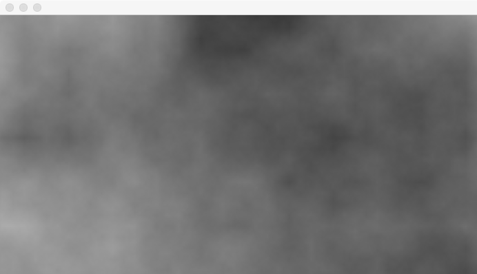
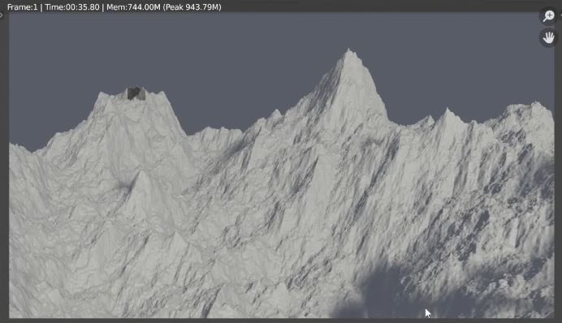

# Algorithms & Sorts
This repository contains various algorithms and sortings:

#### Fractal noise algorithm
Main idea of this algorithm is consists of a creation of a lattice of random (or typically pseudorandom) gradients, 
dot products of which are then interpolated to obtain values in between the lattices.

Noise visualization:

If you use the generated noise as a height map, you can get a terrain that can be used to generate a 3D landscape:

___

#### Bubble sort O(n²)

___

#### Comb sort O(n²)

 
___

#### Insertion sort O(n²)

 
___

#### Selection sort O(n²)

 
